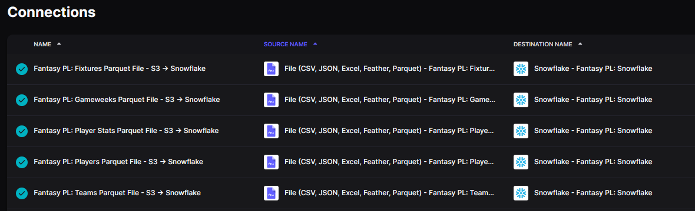
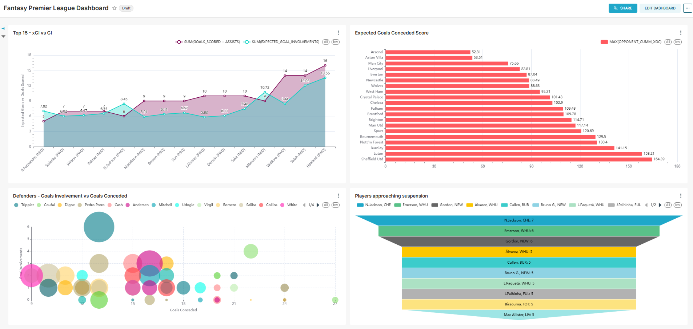
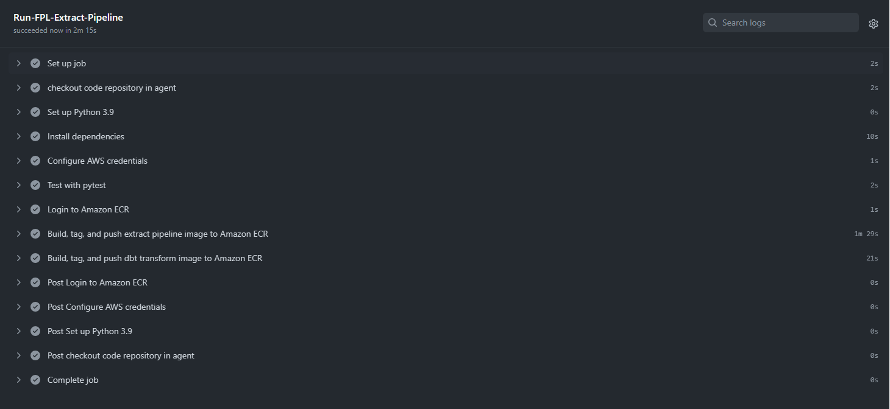

# Fantasy Premier League ETL Pipeline Project 

## Objective 
The objective of this data engineering project is to create analytical datasets from the Fantasy Premier League API and present this data on a reporting dashboard.

## Consumers 
The datasets would be used by Fantasy Premier League players to informed decisions in the game to achieve a higher global rank or win their mini or head-to-head leagues.

## Questions 
The dataset created will allow Fantasy Premier League managers to get information to answer the following questions:

- Who are the players with the highest goal involvements and expected goal involvements to target?
- Who are the fowards and midfielders which the highest xGI in the past 5 gameweeks and that are facing the teams with the lowest cummulative xGC?
- Who are the defenders who have the highest goal involvements and have the lowest goals conceded?
- Who are the best value players (points per cost) in the game?
- Who are the players who are first on penalties and corners for higher attacking returns?

## Source datasets 
The `Fantasy Premier League API` will be used to retrieve all gameweek, fixtures, teams, player and individual player stats. This is a REST API and, while not officially supported, is the API actively used on the live Official Fantasy PL website.

| Source name | Source type | Source documentation |
| - | - | - |
| Fantasy Premier League API | Rest API | N/A |  

Below are a list of end points used to access the source data.

| Endpoint | Description |
| - | - |
| https://fantasy.premierleague.com/api/bootstrap-static/ | Main URL for all premier league overall players, teams and gameweek summaries |
| https://fantasy.premierleague.com/api/fixtures/ | Provides a list of all 380 matches including the score if available |
| https://fantasy.premierleague.com/api/element-summary/{element-id}/	| Provides detailed statistics and historical data for a player | 

## Solution architecture

Solution architecture diagram: 

### <em>Extraction</em>
A Python application calls the Fantasy PL API to extract the data and uploads it as parquet files to an S3 bucket.

### <em>Ingestion</em>
Airbyte loads the data from the S3 parquet files to a Snowflake data warehouse as raw data.

### <em>Storage</em>
A Snowflake data warehouse stores the raw, staging and serving data.

### <em>Transformation</em>
A dbt project transforms the raw resulting in 4 dimension tables, 2 fact tables and 1 one big table.

### <em>Reporting</em>
A Preset dashboards loads the data from Snowflake and is used for data visualisation.

### <em>CI/CD</em>
GitHub Actions triggers the CI/CD pipeline for the Python application in the Extraction step and the dbt project code in the Transformation step. In both cases, the application code is containerised as a Docker image and pushed to an AWS ECR repository.
The GitHub Action workflow also runs pytest to execute any tests in the Python application code.

### <em>Orchestration</em>
Apache Airflow orchestrates the different steps of the pipeline:
* executes the ECS task for the extraction containerised Python application in an EC2 instance.
* triggers the Airbyte data ingestion into the Snowflake data warehouse
* executes the ECS task for the containerised dbt project

