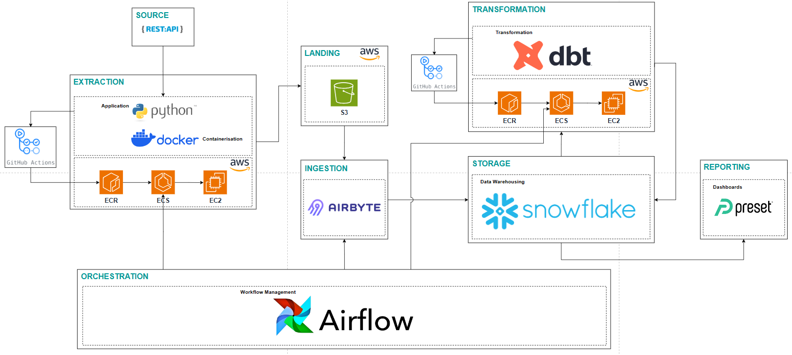

# Fantasy Premier League ETL Pipeline Project 

## Objective 
The objective of this data engineering project is to create analytical datasets from the Fantasy Premier League API and present this data on a reporting dashboard.

## Consumers 
The datasets would be used by Fantasy Premier League players to informed decisions in the game to achieve a higher global rank or win their mini or head-to-head leagues.

## Questions 
The dataset created will allow Fantasy Premier League managers to get information to answer the following questions:

- Who are the players with the highest goal involvements and expected goal involvements to target?
- Who are the fowards and midfielders which the highest xGI in the past 5 gameweeks and that are facing the teams with the lowest cummulative xGC?
- Who are the defenders who have the highest goal involvements and have the lowest goals conceded?
- Who are the best value players (points per cost) in the game?
- Who are the players who are first on penalties and corners for higher attacking returns?

## Source datasets 
The `Fantasy Premier League API` will be used to retrieve all gameweek, fixtures, teams, player and individual player stats. This is a REST API and, while being the API used actively on the live Official Fantasy PL website, is not actually supported for external use

| Source name | Source type | Source documentation |
| - | - | - |
| Fantasy Premier League API | Rest API | N/A |  

Below are a list of end points used to access the source data.

| Endpoint | Description |
| - | - |
| https://fantasy.premierleague.com/api/bootstrap-static/ | Main URL for all premier league overall players, teams and gameweek summaries |
| https://fantasy.premierleague.com/api/fixtures/ | Provides a list of all 380 matches including the score if available |
| https://fantasy.premierleague.com/api/element-summary/{element-id}/	| Provides detailed statistics and historical data for a player | 

## Solution architecture

Solution architecture diagram: 

